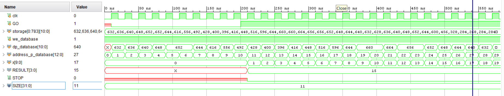

# Convolutional Neural Network for Real-Time Digit Detector in FPGA

## Software Tools
Python 3.5, Tensorflow 1.4.0, Keras 2.1.3

## Neural Network Structure

## Devices
To recreate the device you need 3 components:
* [DE2-115 FPGA](https://www.terasic.com.tw/cgi-bin/page/archive.pl?Language=English&No=502) (\$423 Academic or \$779 Personal)
* [OV7670 Camera Module](https://hshop.vn/mach-camera-ov7670) (43.000₫)
* [2.8 TFT SPI 240x320 V1.2](https://cdn-shop.adafruit.com/datasheets/ILI9341.pdf) (~500.000₫)

## Simulation of TOP.v

[Explain the functions of TOP.v...]

## Pictures of Circuit

## Demo Video with Detection

[Video1.mp4](https://husteduvn-my.sharepoint.com/:v:/g/personal/hai_cnh213609_sis_hust_edu_vn/EeQMdtuOlTJKvW4hsyyp_ZMBOWEdEe8EDmGqAdIqqnXWIg?nav=eyJyZWZlcnJhbEluZm8iOnsicmVmZXJyYWxBcHAiOiJPbmVEcml2ZUZvckJ1c2luZXNzIiwicmVmZXJyYWxBcHBQbGF0Zm9ybSI6IldlYiIsInJlZmVycmFsTW9kZSI6InZpZXciLCJyZWZlcnJhbFZpZXciOiJNeUZpbGVzTGlua0NvcHkifX0&e=DBtQWF)

[Video2.mp4](https://husteduvn-my.sharepoint.com/:v:/g/personal/hai_cnh213609_sis_hust_edu_vn/EbFS03EQIyZNlvDAxNrT73sB-0EvKm0yniBdiSgNoiokUQ?nav=eyJyZWZlcnJhbEluZm8iOnsicmVmZXJyYWxBcHAiOiJPbmVEcml2ZUZvckJ1c2luZXNzIiwicmVmZXJyYWxBcHBQbGF0Zm9ybSI6IldlYiIsInJlZmVycmFsTW9kZSI6InZpZXciLCJyZWZlcnJhbFZpZXciOiJNeUZpbGVzTGlua0NvcHkifX0&e=udSaAi)
